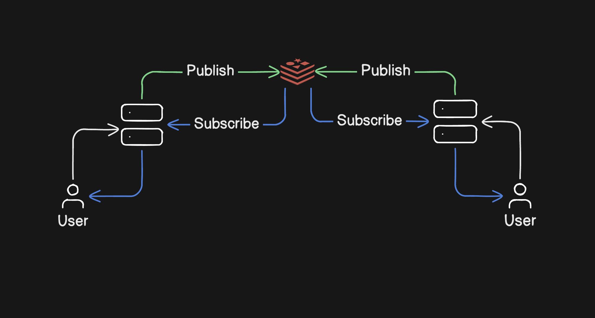

# 1 Million Checkboxes (Redis + Socket.IO)

TL;DR: A small demo that demonstrates server-owned, real-time checkbox state synchronized across browsers using Socket.IO, with Redis Pub/Sub used to scale event propagation across multiple server instances.

> The UI theme says "1 Million Checkboxes" but this demo renders a modest set (default `CHECKBOX_COUNT = 100`) to validate architecture and behavior before large-scale experiments.

---

## Overview

- Purpose: demonstrate a simple, robust pattern for real-time sync where the server is the source of truth and Redis Pub/Sub enables horizontal scaling of WebSocket events.
- Primary features:
  - Server-owned checkbox state
  - REST endpoint for initial hydration
  - Socket.IO events for live updates
  - Redis Pub/Sub for cross-instance event propagation

## Quick Start

1. Install dependencies

```bash
pnpm install
```

2. Start the server (development)

```bash
node --watch index.js
```

3. Or run on a different port for parallel instances

```bash
export PORT=9000 && node --watch index.js
```

Open `http://localhost:8000` (or the port you started) and test with multiple tabs.

## Files of Interest

- `index.js` — server, REST endpoints, Socket.IO wiring
- `redis-connection.js` — Redis helper/connection
- `public/index.html` — frontend UI and client socket code
- `docker-compose.yml` — optional local Redis + app compose

## Endpoints

- `GET /health` — `{ healthy: true }`
- `GET /checkboxes` — `{ checkboxes: [...] }` — returns the current checkbox array for initial hydration

## Socket / Event Contract

- Client -> Server:
  - Event: `client:checkbox:change`
  - Payload: `{ index: number, checked: boolean }`
- Server -> Clients:
  - Event: `server:checkbox:change`
  - Payload: `{ index: number, checked: boolean }`

## How It Works

1. Client fetches `/checkboxes` and builds the initial UI.
2. Client connects to Socket.IO (`io()`), listens for `server:checkbox:change`.
3. On toggle, client emits `client:checkbox:change`.
4. Server updates canonical state (now persisted in Redis), publishes the event to Redis, and broadcasts to local clients.
5. Other server instances subscribed to the Redis channel receive the event and emit it to their connected clients — keeping all browsers in sync.

## Architecture & Scaling

- Single-server: simple, easy to run locally, but limited by one machine's connection capacity.
- Multi-server (horizontal): run N app servers behind a load balancer and use Redis Pub/Sub to share events between instances.

Scaling analogy: In your framing — if one server handles ~1000 connections, then 1000 servers can target roughly `1000 * 1000` aggregate connections, provided infrastructure, state strategy, and backpressure controls are designed correctly.

## Multi-layer Redis (advanced)

- For very large deployments you can chain or tier Redis instances (or add aggregation tiers):

```
redis -> redis -> server -> users
```

- This allows separation of edge ingestion, aggregation, and regional fan-out responsibilities and helps scale the pub/sub fabric independent of app servers.

## State & Rate Limiting

- Canonical state is stored in Redis so any instance can read/write the authoritative values.
- Rate limiting (e.g., token bucket counters) is implemented in Redis enabling consistent throttling across all app instances and protecting the system from bursts.

## Diagram



## Next Steps / Notes

- For large-scale testing consider:
  - Sharding/partitioning checkbox state
  - Batching/compressing events
  - Robust backpressure and connection management
  - Monitoring and observability for event lag and Redis throughput
